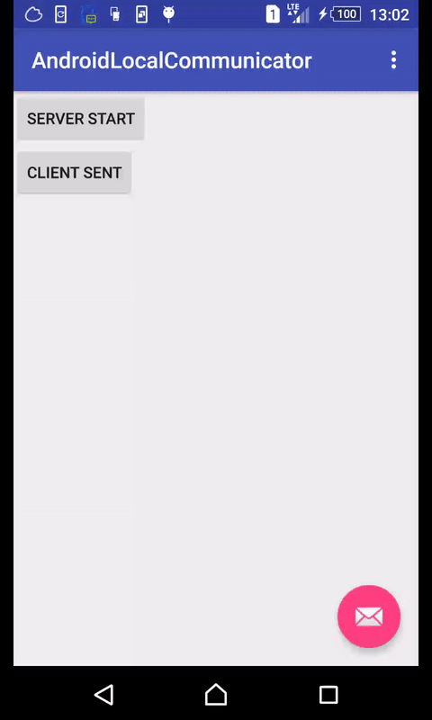

# AndroidLocalCommunicator
A Test Demo for Android local socket communication.

Android os already provide powerful communication methods for IPC. I just want to check if local socket communication is workable.

As showed in Demo, local socket communication works fine, though it requires INTERNET permission.

So it is easy to develop application groups which communicate through local server.

# Todo
I am thinking about developing an social application which based on distributed local server. No idea right now. :D

# Demo

# License
    Copyright 2015 kirsting

    Licensed under the Apache License, Version 2.0 (the "License");
    you may not use this file except in compliance with the License.
    You may obtain a copy of the License at

       http://www.apache.org/licenses/LICENSE-2.0

    Unless required by applicable law or agreed to in writing, software
    distributed under the License is distributed on an "AS IS" BASIS,
    WITHOUT WARRANTIES OR CONDITIONS OF ANY KIND, either express or implied.
    See the License for the specific language governing permissions and
    limitations under the License.
